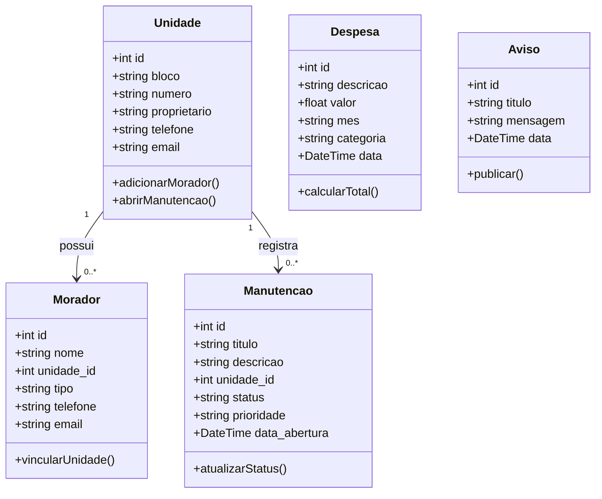

```mermaid
classDiagram
    class Unidade {
        +int id
        +string bloco
        +string numero
        +string proprietario
        +string telefone
        +string email
        +adicionarMorador()
        +abrirManutencao()
    }

    class Morador {
        +int id
        +string nome
        +int unidade_id
        +string tipo
        +string telefone
        +string email
        +vincularUnidade()
    }

    class Manutencao {
        +int id
        +string titulo
        +string descricao
        +int unidade_id
        +string status
        +string prioridade
        +DateTime data_abertura
        +atualizarStatus()
    }

    class Despesa {
        +int id
        +string descricao
        +float valor
        +string mes
        +string categoria
        +DateTime data
        +calcularTotal()
    }

    class Aviso {
        +int id
        +string titulo
        +string mensagem
        +DateTime data
        +publicar()
    }

    Unidade "1" --> "0..*" Morador : possui
    Unidade "1" --> "0..*" Manutencao : registra
```
