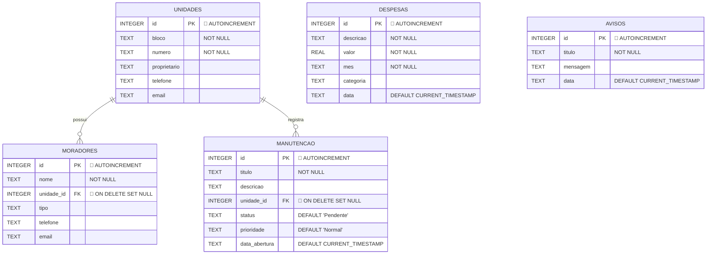

```mermaid
erDiagram
    UNIDADES {
        INTEGER id PK "🔑 AUTOINCREMENT"
        TEXT bloco "NOT NULL"
        TEXT numero "NOT NULL"
        TEXT proprietario
        TEXT telefone
        TEXT email
    }

    MORADORES {
        INTEGER id PK "🔑 AUTOINCREMENT"
        TEXT nome "NOT NULL"
        INTEGER unidade_id FK "🔗 ON DELETE SET NULL"
        TEXT tipo
        TEXT telefone
        TEXT email
    }

    MANUTENCAO {
        INTEGER id PK "🔑 AUTOINCREMENT"
        TEXT titulo "NOT NULL"
        TEXT descricao
        INTEGER unidade_id FK "🔗 ON DELETE SET NULL"
        TEXT status "DEFAULT 'Pendente'"
        TEXT prioridade "DEFAULT 'Normal'"
        TEXT data_abertura "DEFAULT CURRENT_TIMESTAMP"
    }

    DESPESAS {
        INTEGER id PK "🔑 AUTOINCREMENT"
        TEXT descricao "NOT NULL"
        REAL valor "NOT NULL"
        TEXT mes "NOT NULL"
        TEXT categoria
        TEXT data "DEFAULT CURRENT_TIMESTAMP"
    }

    AVISOS {
        INTEGER id PK "🔑 AUTOINCREMENT"
        TEXT titulo "NOT NULL"
        TEXT mensagem
        TEXT data "DEFAULT CURRENT_TIMESTAMP"
    }

    UNIDADES ||--o{ MORADORES : "possui"
    UNIDADES ||--o{ MANUTENCAO : "registra"
```
