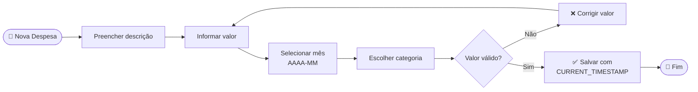

```mermaid
flowchart LR
    A([🏁 Nova Despesa]) --> B[Preencher descrição]
    B --> C[Informar valor]
    C --> D[Selecionar mês<br/>AAAA-MM]
    D --> E[Escolher categoria]
    E --> F{Valor válido?}
    F -- Não --> G[❌ Corrigir valor]
    G --> C
    F -- Sim --> H[✅ Salvar com<br/>CURRENT_TIMESTAMP]
    H --> I([🏁 Fim])
```
