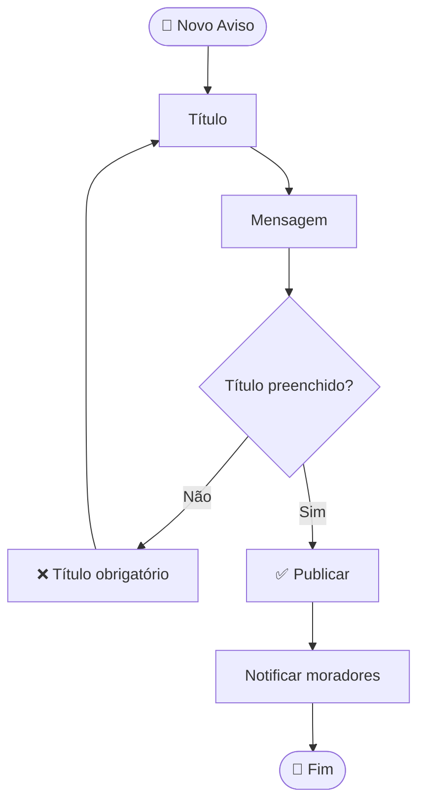

```mermaid
flowchart TD
    A([🏁 Novo Aviso]) --> B[Título]
    B --> C[Mensagem]
    C --> D{Título preenchido?}
    D -- Não --> E[❌ Título obrigatório]
    E --> B
    D -- Sim --> F[✅ Publicar]
    F --> G[Notificar moradores]
    G --> H([🏁 Fim])
```
