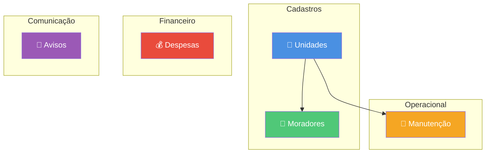

```mermaid
graph TB
    subgraph Cadastros
        U[🏢 Unidades]
        M[👥 Moradores]
    end

    subgraph Operacional
        MT[🔧 Manutenção]
    end

    subgraph Financeiro
        D[💰 Despesas]
    end

    subgraph Comunicação
        A[📢 Avisos]
    end

    U --> M
    U --> MT

    style U fill:#4A90E2,color:#fff
    style M fill:#50C878,color:#fff
    style MT fill:#F5A623,color:#fff
    style D fill:#E94B3C,color:#fff
    style A fill:#9B59B6,color:#fff
```
