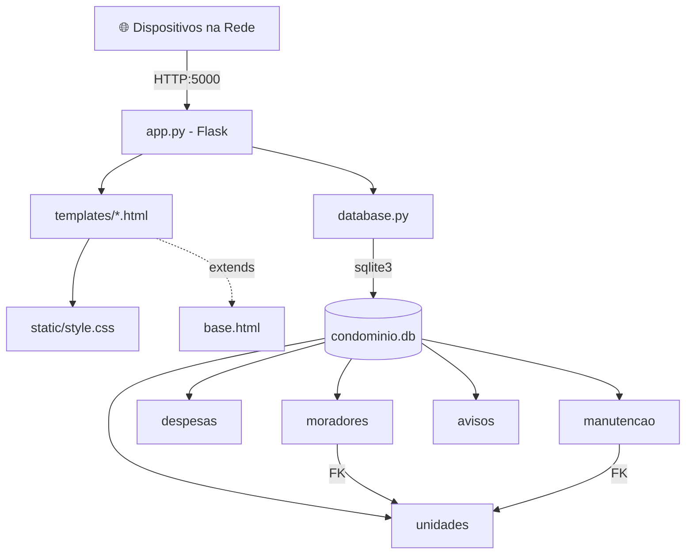

```mermaid
graph TD
    A[🌐 Dispositivos na Rede] -->|HTTP:5000| B[app.py - Flask]
    B --> C[templates/*.html]
    B --> D[database.py]
    C --> E[static/style.css]
    C -.extends.-> F[base.html]
    D -->|sqlite3| G[(condominio.db)]
    
    G --> H[unidades]
    G --> I[moradores]
    G --> J[despesas]
    G --> K[manutencao]
    G --> L[avisos]
    
    I -->|FK| H
    K -->|FK| H
```
