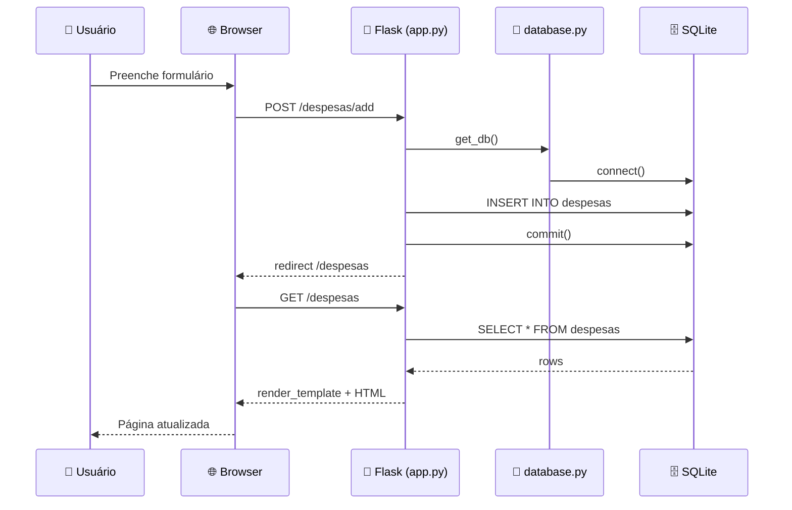

```mermaid
sequenceDiagram
    participant U as 👤 Usuário
    participant B as 🌐 Browser
    participant F as 🐍 Flask (app.py)
    participant D as 💾 database.py
    participant S as 🗄️ SQLite

    U->>B: Preenche formulário
    B->>F: POST /despesas/add
    F->>D: get_db()
    D->>S: connect()
    F->>S: INSERT INTO despesas
    F->>S: commit()
    F-->>B: redirect /despesas
    B->>F: GET /despesas
    F->>S: SELECT * FROM despesas
    S-->>F: rows
    F-->>B: render_template + HTML
    B-->>U: Página atualizada
```
