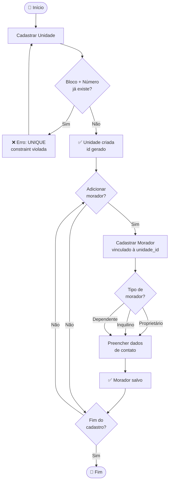

```mermaid
flowchart TD
    A([🏁 Início]) --> B[Cadastrar Unidade]
    B --> C{Bloco + Número<br/>já existe?}
    C -- Sim --> D[❌ Erro: UNIQUE<br/>constraint violada]
    D --> B
    C -- Não --> E[✅ Unidade criada<br/>id gerado]
    E --> F{Adicionar<br/>morador?}
    F -- Sim --> G[Cadastrar Morador<br/>vinculado à unidade_id]
    G --> H{Tipo de<br/>morador?}
    H -- Proprietário --> I[Preencher dados<br/>de contato]
    H -- Inquilino --> I
    H -- Dependente --> I
    I --> J[✅ Morador salvo]
    J --> K{Fim do<br/>cadastro?}
    F -- Não --> K
    K -- Não --> F
    K -- Sim --> L([🏁 Fim])
```
